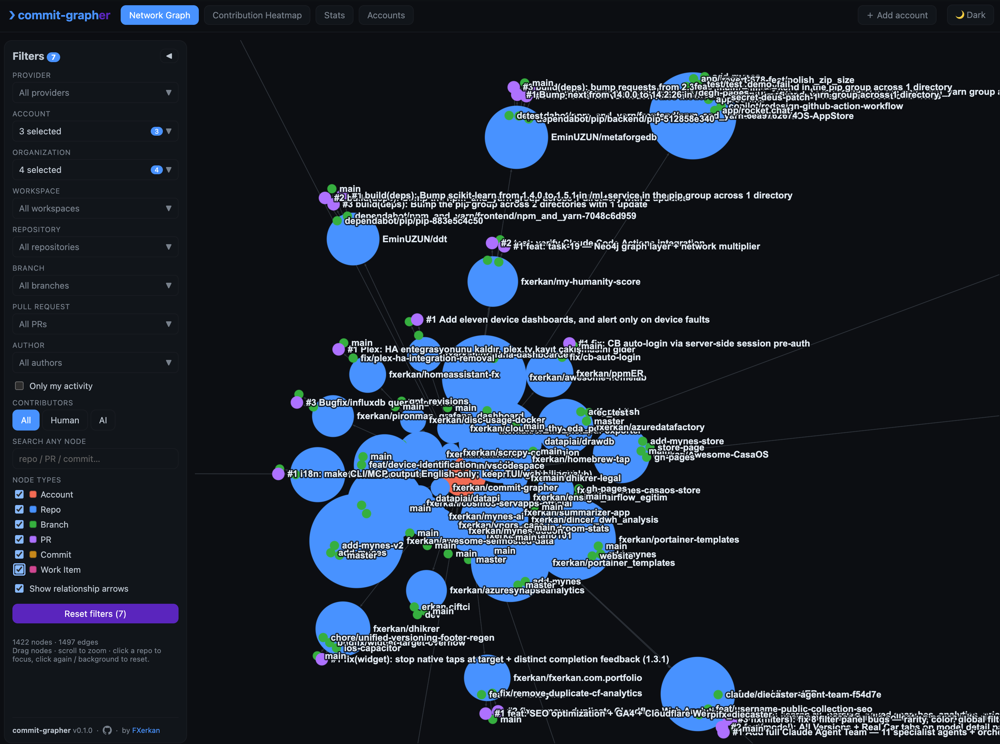
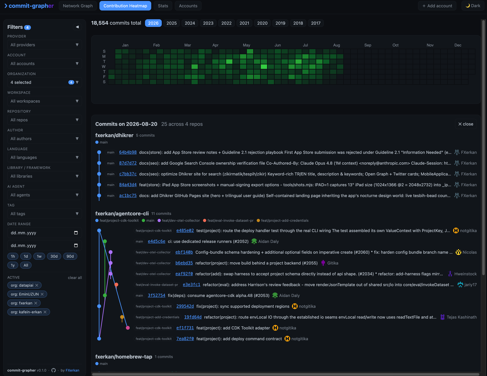
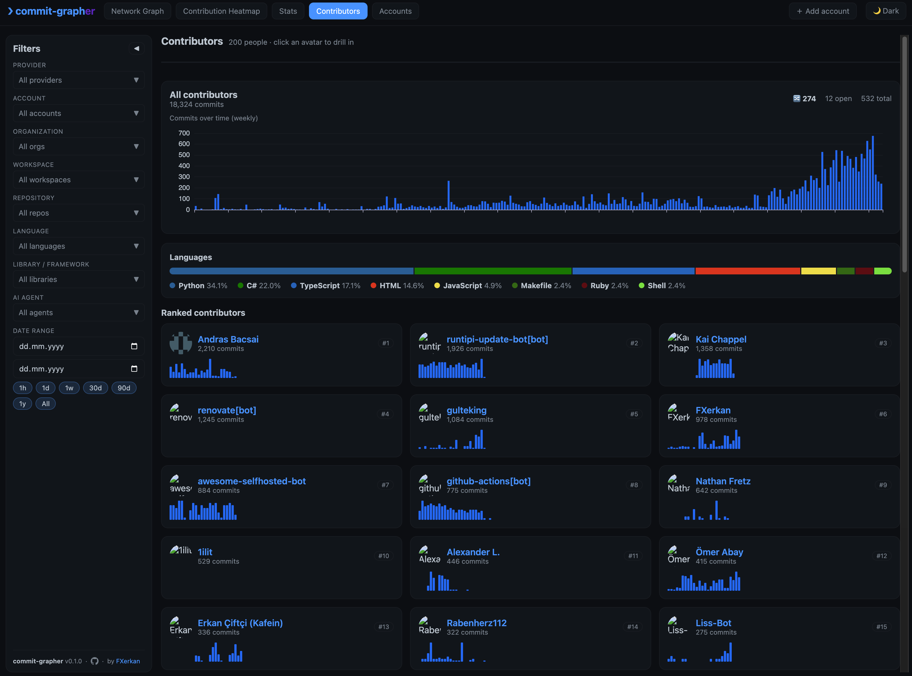
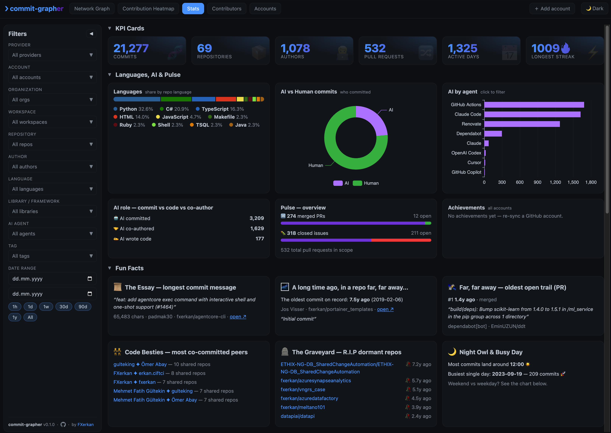
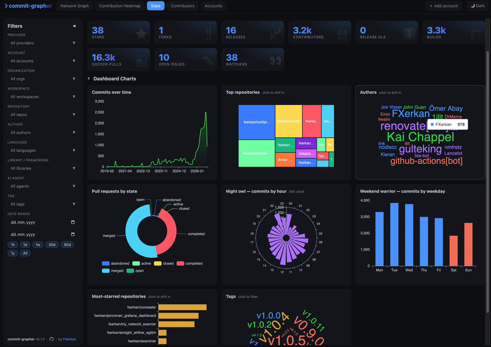
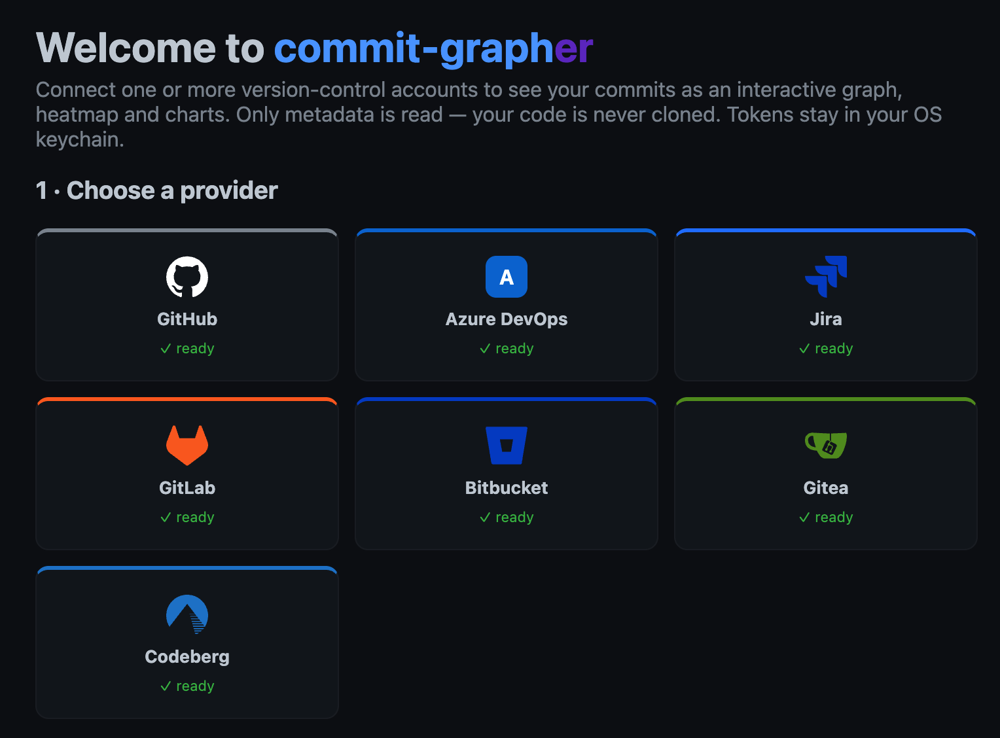
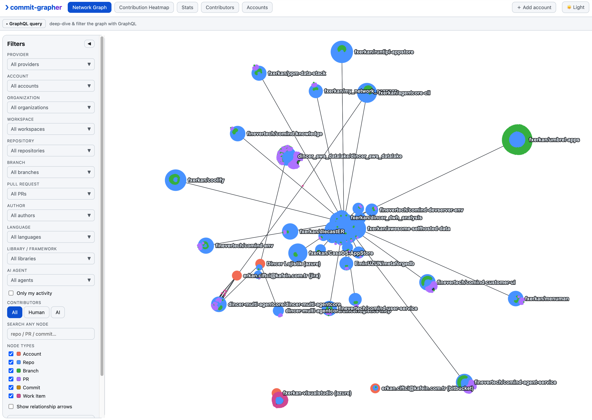

# commit-graph`er`

<sub>[English](README.md) · 🌐 **Türkçe**</sub>

> **Git geçmişin, deşifre edildi.** commit-grapher **tüm** sürüm kontrol
> hesaplarındaki her commit'i, dalı ve pull request'i toplar, hepsini tek bir muhteşem
> derecede nerd bir panoya taşır ve sabahın 2'sindeki kodlama alışkanlıklarını nazikçe
> ele verir — hem de **kodunun tek bir satırını bile okumadan.**

GitHub, Azure DevOps, GitLab, Bitbucket, Gitea ve Codeberg ile konuşur (ve Jira
issue'larını commit'lerinle eşleştirir), sağlayıcıların REST API'leri üzerinden **yalnızca
git meta verisini** okur ve token'larını işletim sisteminin anahtarlığında (keychain) tutar
— asla diske, asla kodun içine, asla olmaması gereken bir yere yazmaz.

<sub>Yerel-öncelikli · yalnızca meta veri · telemetri yok · v0.1.0</sub>

---

## Neler elde edersin

### 🕸️ Ağ Grafiği — amiral gemisi
**Hesaplar → repolar → dallar → PR'lar → commit'ler** yapısını gösteren, Obsidian tarzı,
fizik motorlu bir WebGL grafiği (Sigma.js). Yakınlaş, sürükle, bir düğümün üzerine gelerek
komşuluğunu aydınlat, bir repoya tıklayarak odaklan ve içine in. Zengin bir sol filtre
paneli; sağlayıcı, hesap, organizasyon, çalışma alanı, repo, dal, PR, yazar ve etikete göre
dilimler — üstüne insan-vs-YZ anahtarı ve "yalnızca benim aktivitem".

### 🟩 Katkı Isı Haritası
Tanıdık GitHub takvimi — ama **her** sağlayıcı bir arada. Herhangi bir güne tıklayarak
gerçek bir **git-grafiğine** in (dal/birleştirme şeritleri, tıklanabilir commit linkleri).

### 📊 İstatistik panosu
KPI kartları ve gerçekten eğlenceli derinlemesine analizler: **Kompozisyon** (en uzun commit
mesajın), **Çok uzun zaman önce, çok uzaktaki bir repoda** (en eski commit'in/PR'ın), **Kod
Dostları** (en çok yan yana commit attığın kişiler), **Mezarlık** (terk ettiğin repolar),
**Gece Kuşu** saatin, en çok yıldız alan repolar, bir etiket bulutu ve repo bazında
zenginleştirme (yıldızlar, fork'lar, sürümler, katkıcılar, Docker çekilmeleri, npm
indirmeleri). Her şey çapraz filtrelenir ve her bölüm katlanır.

### 👥 Katkıcılar
Repolarına dokunmuş herkes, sıralanmış — katkıcı başına commit sayıları ve insan-vs-YZ
kırılımıyla (evet, hangi commit'leri robotlarının yazdığını biliyor).

### 🔌 Hesaplar
Bir sağlayıcıyı Personal Access Token veya GitHub OAuth cihaz akışıyla ekle, hesapları
yeniden adlandır ve tüm veri setini JSON olarak dışa/içe aktar.

## Ekran görüntüleri

**Ağ Grafiği** — hesaplar, repolar, dallar, PR'lar ve commit'ler tek bir canlı harita olarak:



<table>
<tr>
<td width="50%"><b>Katkı Isı Haritası</b><br></td>
<td width="50%"><b>Katkıcılar</b><br></td>
</tr>
<tr>
<td><b>İstatistik panosu</b><br></td>
<td><b>İstatistik — repo istatistikleri &amp; grafikler</b><br></td>
</tr>
<tr>
<td><b>Hesaplar &amp; entegrasyonlar</b><br></td>
<td><b>Açık tema</b><br></td>
</tr>
</table>

> 📖 Canlı animasyonlu bir grafik içeren tam bir tanıtım **[proje sitesinde](https://fxerkan.github.io/commit-grapher/)** bulunuyor.

## Gizlilik, açıkça

- **Yalnızca meta veri.** Commit'ler, dallar, PR'lar, etiketler, repo istatistikleri.
  Uygulama bir repoyu *asla* klonlamaz veya dosya içeriğini okumaz. Yalnızca commit
  mesajlarını yargılar.
- **Token'lar işletim sisteminin anahtarlığında yaşar** (`keyring` ile) — asla düz metin
  olarak diske yazılmaz, asla loglanmaz, asla commit'lenmez.
- **Yerel-öncelikli.** Kendi makinende çalışır ve doğrudan sağlayıcılarla konuşur. Aracı yok.

## Çalıştır

Tek komut — venv'i oluşturur, her şeyi kurar, frontend'i derler ve hepsini `:8000` üzerinde
sunar:

```bash
./start.sh                # → http://localhost:8000
```

Geliştirirken hot reload mı istiyorsun? Backend ile Vite geliştirme sunucusunu birlikte
çalıştırır:

```bash
./start.sh dev            # backend :8000 · frontend :5173
```

<details>
<summary>…ya da elle adımlar</summary>

```bash
# backend (Python ≥ 3.13)
python -m venv .venv && source .venv/bin/activate
pip install -e backend
uvicorn app.main:app --app-dir backend --reload    # http://localhost:8000

# frontend — geliştirme (hot reload, /api'yi :8000'e yönlendirir)
cd frontend && npm install && npm run dev           # http://localhost:5173
# ...ya da bir kez derle ve backend'in :8000'de sunmasına izin ver
cd frontend && npm run build
```
</details>

## Bir hesap bağla

Uygulamayı aç → **Accounts** → bir sağlayıcı + Personal Access Token ekle → **Sync** → keşfet.
Sağlayıcı bazında, adım adım kılavuzlar (token yetkileri, tuzaklar) [`docs/`](docs/) içinde:

| Sağlayıcı | Kılavuz |
|---|---|
| GitHub | [docs/github.tr.md](docs/github.tr.md) |
| Azure DevOps | [docs/azure-devops.tr.md](docs/azure-devops.tr.md) |
| GitLab | [docs/gitlab.tr.md](docs/gitlab.tr.md) |
| Bitbucket | [docs/bitbucket.tr.md](docs/bitbucket.tr.md) |
| Gitea | [docs/gitea.tr.md](docs/gitea.tr.md) |
| Codeberg | [docs/codeberg.tr.md](docs/codeberg.tr.md) |
| Jira (issue eşleştirme) | [docs/jira.tr.md](docs/jira.tr.md) |

> **İpucu:** tam GitHub organizasyon kapsamı için **klasik** bir token (`repo` + `read:org`)
> kullan. Fine-grained token'lar, organizasyon onaylamadıkça bir organizasyonun repolarını
> göremez.

## Test

```bash
python -m app.test_charts     # backend/ içinden, venv aktifken
```

## Sürümleme

Semantik Sürümleme, [CHANGELOG.md](CHANGELOG.md) içinde takip edilir. Sürüm bir kez
`frontend/package.json` içinde tanımlanır ve derleme sırasında enjekte edilir (her sayfada
filtre paneli altbilgisinde görünür). 1.0 öncesi: patch = düzeltmeler, minor = özellikler,
major = ilk kararlı sürüm.

## Yol haritası

[Backlog.md](https://backlog.md) ile `backlog/` altında takip edilir — ağ grafiği
iyileştirmeleri, daha fazla sağlayıcı, daha zengin istatistikler ve canlı animasyonlu grafik
içeren bir GitHub Pages sitesi.

---

[FXerkan](https://github.com/FXerkan) tarafından geliştirildi · [github.com/fxerkan/commit-grapher](https://github.com/fxerkan/commit-grapher)
